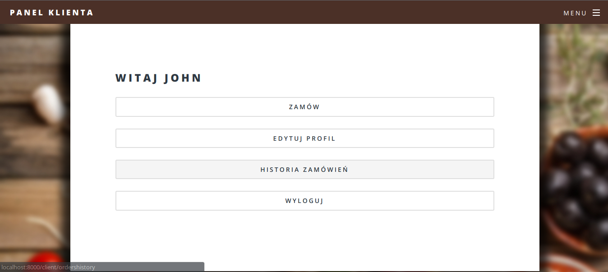
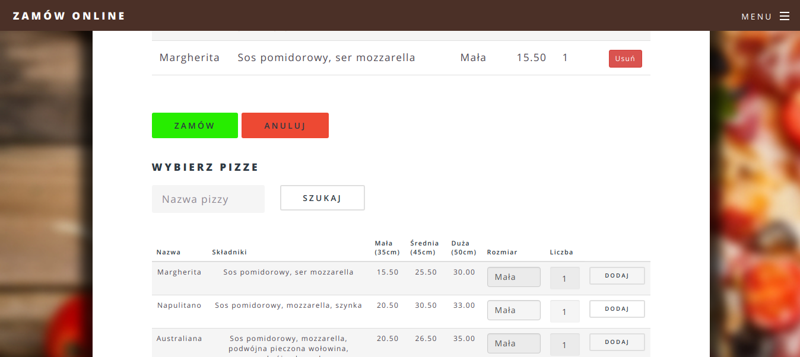
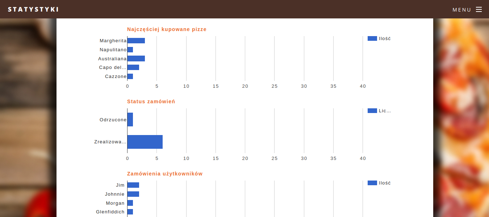

# La_Cazzinara

Prosty system zamawiania pizzy.

Technologie wykorzystane w projekcie: PHP, framework Laravel 5.7, MySQL.

### Strona główna
[](https://raw.githubusercontent.com/iamkiwi/la_cazzinara/master/docs/images/ss1.png)

### Panel klienta
[](https://raw.githubusercontent.com/iamkiwi/la_cazzinara/master/docs/images/ss2.png)

### Składanie zamówień po stronie klienta
[](https://raw.githubusercontent.com/iamkiwi/la_cazzinara/master/docs/images/ss3.png)

### Historia zamówień po stronie klienta
[](https://raw.githubusercontent.com/iamkiwi/la_cazzinara/master/docs/images/ss4.png)

### Panel administratora
[](https://raw.githubusercontent.com/iamkiwi/la_cazzinara/master/docs/images/ss5.png)

### Zarządzanie zamówieniami po stronie administratora
[](https://raw.githubusercontent.com/iamkiwi/la_cazzinara/master/docs/images/ss6.png)

### Zarządzanie pizzami po stronie administratora
[](https://raw.githubusercontent.com/iamkiwi/la_cazzinara/master/docs/images/ss7.png)

### Statystyki po stronie administratora
[](https://raw.githubusercontent.com/iamkiwi/la_cazzinara/master/docs/images/ss8.png)


# Funkcjonalności
+ Użytkownik może założyć konto w systemie i się na nie zalogować.
+ Użytkownik może edytować swoje konto, złożyć zamówienie i przeglądać historię swoich transakcji
+ Użytkownik może skorzystać z systemu feedbacku (wystawić opinie nt. danego zamówienia)

+ Administrator może zarządzać kontami użytkowników
+ Administrator może dodawać, usuwać, edytować pizze
+ Administrator może podglądać bieżące zamówienia
+ Administrator może przeglądać podsumowanie finansowe
+ Administrator ma wgląd w statystyki przedsiębiorstwa

## Wymagania
* PHP >= 7.1,
* MySQL,
* (https://laravel.com/docs/5.7/installation#server-requirements) framework Laravel.

## Instalacja
1. Sklonowanie repozytorium przez wydanie polecenia:
```bash
$ git clone https://github.com/IamKiwi/La_Cazzinara.git
```
2. Przejście do katalogu z projektem, skopiowanie i modyfikacja pliku .env (połączenie z odpowiednią bazą danych).
Należy wyedytować następujące stałe: DB_DATABASE, DB_USERNAME, DB_PASSWORD
```bash
$ cd la_cazzinara/
$ cp .env.example .env
$ vim .env
```
3. Instalacja zależności poprzez wydanie polecenia w katalogu z projektem:
```bash
$ composer install 
```
4. Wygenerowanie klucza aplikacji przez wydanie polecenia w katalogu z projektem:
```bash
$ php artisan key:generate
```
5. Uruchomienie migracji wraz z seederami przez wydanie polecenia w katalogu z projektem:
```bash
$ php artisan migrate --seed
```
6. Uruchomienie aplikacji przez wydanie polecenia w katalogu z projektem:
```bash
$ php artisan serve
```
7. Aplikacja jest dostępna pod: [127.0.0.1:8000](http://127.0.0.1:8000).

# Zewnętrzne biblioteki
* Koszyk [darryldecode/cart](https://github.com/darryldecode/laravelshoppingcart)
* Wykresy [khill/lavacharts](https://github.com/kevinkhill/lavacharts)

# Jak używać?
+ [Rejestracja użytkownika](#Rejestracja użytkownika)
+ [Panel klienta](#Panel klienta)
+ [Składanie zamówień](#Składanie zamówień)
+ [Edycja profilu](#Edycja profilu) 
+ [Historia złożonych zamówień](#Historia złożonych zamówień)
+ [Wystawianie opinii przez użytkownika](#Wystawianie opinii przez użytkownika)
+ [Panel administratora](#Panel administratora)
+ [Zarządzanie pizzami](#Zarządzanie pizzami)
+ [Zarządzanie użytkownikami](#Zarządzanie użytkownikami)
+ [Obsługa zamówień](#Obsługa zamówień)
+ [Feedback użytkowników](#Feedback użytkowników)
+ [Podsumowanie finansowe](#Podsumowanie finansowe)
+ [Statystyki](#Statystyki)

## Rejestracja użytkownika
Użytkownik rejestruje się poprzez wypełnienie formularza rejestracyjnego 
dostępnego z poziomu strony głównej, bądź menu. Jeśli wszystkie dane się
zgadzają po udanej rejestracji użytkownik zostanie przekierowany
do swojego panelu klienta. W przeciwnym wypadku otrzyma stosowny komunikat
jakie dane należy poprawić.

[](https://raw.githubusercontent.com/iamkiwi/la_cazzinara/master/docs/images/usage/ss1.png)

## Panel Klienta
Z poziomu panelu klienta mamy dostęp możemy złożyć zamówienie, edytować
swój profil oraz przeglądać historię złożonych zamówień.

[](https://raw.githubusercontent.com/iamkiwi/la_cazzinara/master/docs/images/usage/ss22.png)

## Składanie zamówień
Klikając przycisk "Zamów" w panelu klienta, zostaniemy przeniesieni
do widoku z koszykiem oraz listą pizz do wybrania. W tym miejscu można
dodać wybraną pizzę do koszyka określając jej rozmiar oraz liczbę (ile pizz dodać).

[](https://raw.githubusercontent.com/iamkiwi/la_cazzinara/master/docs/images/usage/ss2.png)

Po wszystkim należy nacisnąć przycisk "Zamów". Zostaniemy przeniesieni do widoku
potwierdzenia zamówienia. Na tym etapie można jeszcze anulować zamówienie
klikając przycisk "Rozmyśliłem się". Jeśli jesteśmy zdecydowani należy kliknąć
przycisk "Zamawiam".

W ostatnim widoku zamówienia można śledzić jego status. Strona odświeża się
automatycznie co 5 sek. Na tym etapie już tylko administrator decyduje
o dalszych losach zamówienia.

[](https://raw.githubusercontent.com/iamkiwi/la_cazzinara/master/docs/images/usage/ss3.png)

## Edycja profilu
Klikając przycisk "Edytuj profil" z poziomu panelu klienta mamy możliwość
edycji swoich danych. Formularz jest taki sam jak w przypadku rejestracji,
z tym, że w tym wypadku jest on już wypełniony danymi, które można zmienić.
Użytkownik może również zmienić swoje hasło klikając przycisk "Zmień hasło".

[](https://raw.githubusercontent.com/iamkiwi/la_cazzinara/master/docs/images/usage/ss4.png)

## Historia złożonych zamówień
W widoku historii zamówień użytkownik może podejrzeć złożone dotychczas
zamówienia. Szczegóły zamówienia (Nazwa pizzy, składniki, liczba, rozmiar)
są dostępne po kliknięciu przycisku "Zobacz" w kolumnie szczegóły.

[](https://raw.githubusercontent.com/iamkiwi/la_cazzinara/master/docs/images/usage/ss5.png)

## Wystawianie opinii przez użytkownika
W widoku historii zamówień użytkownik może wystawić opinię
na temat danego zamówienia klikając przycisk "Wystaw" w kolumnie
"Wystaw opinię". Opinię można wystawić tylko dla zamówień o statusie
"Zrealizowane". W widoku wystawiania opinii użytkownik może określić,
rodzaj opinii (Pozytywna, Neutralna czy Negatywna) oraz jej widoczność
(Publiczna, Prywatna). Jednoczesne ustawienie opinii jako pozytywnej i publicznej
poskutkuje jej pojawieniem się w sliderze na dole strony głównej aplikacji.

[](https://raw.githubusercontent.com/iamkiwi/la_cazzinara/master/docs/images/usage/ss6.png)

## Panel administratora
Z poziomu panelu administratora mamy możliwość zarządzania pizzami,
użytkownikami, zamówieniami oraz wgląd do podsumowania finansowego,
wystawionych przez użytkowników opinii oraz statystyk przedsiębiorstwa.

[](https://raw.githubusercontent.com/iamkiwi/la_cazzinara/master/docs/images/usage/ss7.png)

## Zarządzanie pizzami
W widoku zarządzania pizzami administrator ma możliwość dodawania, edycji
oraz usuwania pizz. Usuwanie wykorzystuje metodę "soft delete", tzn. dane 
w bazie są oznaczane jako przez ustawienie daty w kolumnie deleted_at
i uważane za "usunięte". Po stronie administratora widać "usunięte" rekordy,
albowiem ma on możliwość przywrócenia takich danych.

[](https://raw.githubusercontent.com/iamkiwi/la_cazzinara/master/docs/images/usage/ss8.png)

## Zarządzanie użytkownikami
W widoku zarządzania użytkownikami administrator może edytować dane użytkownika,
bądź deaktywować jego konto. W razie deaktywacji konta może zostać ono przywrócone.
Na wykonanie powyższych operacji pozwala rozwijane menu wywoływanie poprzez kliknięcie
na ikonę koła zębatego przy rekordzie użytkownika.

[](https://raw.githubusercontent.com/iamkiwi/la_cazzinara/master/docs/images/usage/ss9.png)

## Obsługa zamówień
W widoku obsługi zamówień administrator może zarządzać zamówieniami. Może podejrzeć
szczegóły zamówienia klikając przycisk "Zobacz" w kolumnie "Szczegóły zamówienia".
Poprzez kliknięcie na ikonę koła zębatego można zmienić status zamówienia.
Status może przyjmować wartości "Oczekiwanie na potwierdzenie", "Odrzucone",
"Odmówione", "Gotowe", "Zrealizowane". Odpowiednio oznacza to, że zamówienie:
Oczekuję na potwierdzenie ze strony administratora, Administrator odrzucił
zamówienie, Zamówienie zostało odmówione przez klienta (Np. przy odbiorze),
Zamówienie jest gotowe i wysłane do klienta ale jeszcze nie dotarło, Zamówienie zostało
wysłane, a klient je przyjął i za nie zapłacił.

[](https://raw.githubusercontent.com/iamkiwi/la_cazzinara/master/docs/images/usage/ss10.png)

## Feedback użytkowników
W widoku opinii administrator może przeglądać opinie wystawione przez użytkowników. 
Opinia pojawia się po kliknięciu przycisku "Zobacz" na w kolumnie "Opinia". Opinii
użytkowników nie można, ani edytować, ani usuwać.

[](https://raw.githubusercontent.com/iamkiwi/la_cazzinara/master/docs/images/usage/ss11.png)

## Podsumowanie finansowe
W widoku podsumowania finansowego administrator ma wgląd do podstawowych
statystyk związanych z finansami. Zyski to wszystkie zamówienia, których
status ustawiono na "Zrealizowane". Straty obrazują wszystkie zamówienia
o statusach "Odrzucone" lub "Odmówione". Bilans pokazuje różnicę, między
zyskami, a stratami.

[](https://raw.githubusercontent.com/iamkiwi/la_cazzinara/master/docs/images/usage/ss12.png)

## Statystyki
W widoku statystyk administrator ma wgląd do ogólnych statystyk funkcjonowania
przedsiębiorstwa. Wykresy obrazują m.in. jakie pizze są najchętniej zamawiane,
ile zamówień ma określony status, czy który użytkownik składa najwięcej zamówień.

[](https://raw.githubusercontent.com/iamkiwi/la_cazzinara/master/docs/images/usage/ss13.png)

# Licencja
La_cazzinara korzysta z licencji MIT.